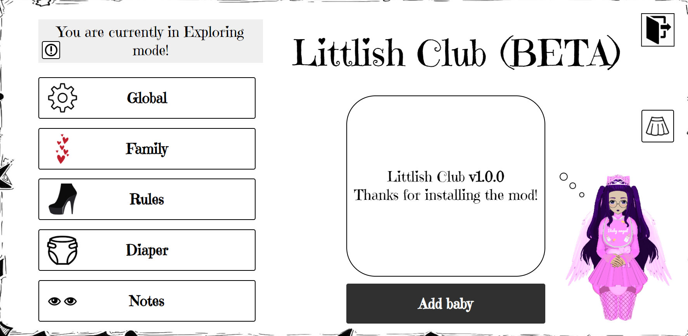

# <b>Littlish Club</b>

Similar to <b>BCX</b> but with <b>ABDL</b> aspects.
## It's still at an early stage of development.
# Features
| Name | Description |
|:-----------------:|--------------------|
| Exploring Mode | Exploring mode allows you to explore the mod without having family. It removes all restrictions and allows you to fully manage your mod settings.|
| Family                     | You can have your own family: babies, mommy and caregivers. Mommy always has all access rights, access rights of caregivers are configured in the settings.  |
| Rules | Rules let you to manipulate events, restrictions, functions that will work. You can also set conditions under which rule will be active. More rules will be added in future.|
| Cyber Diaper | High-tech diaper equipped with a large capacity and a system that allows you to lock it and change it without removing it. [Wetting and messing mechanics will be provided from ABCL addon, its not Littlish Club's part]|
| Notes                      | Users can leave notes so that mommy or caregivers can read them. |
| Logs | Records of recent actions, changes, by whom they were made and when. |
| Littlish Wardrobe          | Outfits library with a lot of different babiesh cute outfits. Many thanks to everyone who provided the outfits ^.^                                                                                  |
# 💜 Thanks
- **dDeepLb**: Thanks you for developing Themed API and helping me implement it into Littlish Club, thanks for the advice and code references. 
~~DeepL :3~~
# Installation
### Tampermonkey
https://github.com/FurryZoi/Littlish-Club/raw/main/littlishClub.user.js
### Bookmark
https://github.com/FurryZoi/Littlish-Club/raw/main/littlishClub.bookmark.js