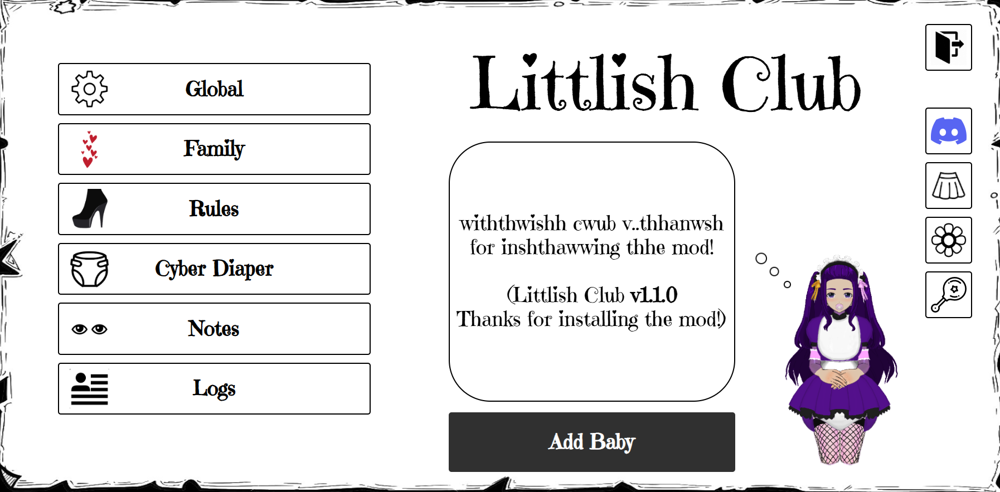

# <b>Littlish Club</b>

Similar to <b>BCX</b> but with <b>ABDL</b> aspects. 
## It's still at an early stage of development.
# Features
| Name                       | Description                                                                                                                                                                                             |
|----------------------------|---------------------------------------------------------------------------------------------------------------------------------------------------------------------------------------------------------|
| Exploring Mode             | Exploring mode allows you to explore the mod without having family.                                                                                                                                     |
| Family                     | You can have your own family: babies, mommy, or caregivers. Mommy always has all access rights, access rights of caregivers are configured in the settings.                                             |
| Rules                      | Rules let you to manipulate events, restrictions, functions that will work. You can also set conditions under which rule will be active.                                                                |
| Diaper Games               | Diaper locking so that the baby cannot take it off on them own. Diaper changes. Diuretics and laxatives. 
[Not implemented yet, I am deciding how to integrate it with ABCL]
 |
| Notes                      | You can leave notes so that mommy or caregivers can read it.                                                                                                                                            |
| Littlish Wardrobe          | Outfits library with a lot of different babiesh cute outfits. Many thanks to everyone who provided the outfits ^.^                                                                                      |
## Installation
### Tampermonkey
https://github.com/FurryZoi/Littlish-Club/raw/main/littlishClub.user.js
### Bookmark
https://github.com/FurryZoi/Littlish-Club/raw/main/littlishClub.bookmark.js